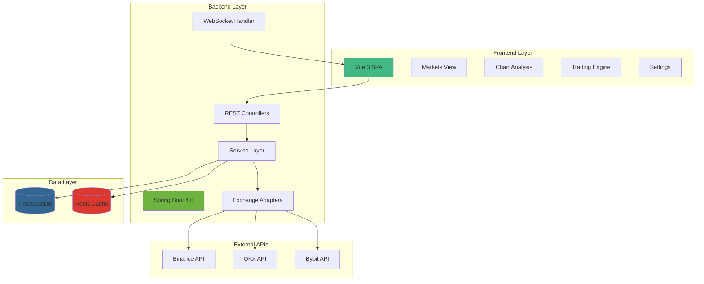

# ChanLab Market - AI Context Documentation

> **Last Updated**: 2026-01-14
> **Project Type**: Full-stack Trading Platform
> **Architecture**: Spring Boot 4.0 + Vue 3 + TimescaleDB

---

## 📋 Project Overview

**ChanLab Market** is a cryptocurrency market data platform with real-time synchronization, historical data backfill, and technical analysis capabilities. The system integrates with multiple cryptocurrency exchanges (Binance, OKX, Bybit) to provide market data, trading signals, and automated trading features based on Chan Theory (缠论) technical analysis.

### Core Capabilities

- **Multi-Exchange Integration**: Unified adapter pattern for Binance, OKX, and Bybit APIs
- **Real-time Data Sync**: WebSocket-based live market data streaming
- **Historical Backfill**: Batch processing system for historical K-line data recovery
- **Data Integrity**: Automated gap detection and repair mechanisms
- **Chan Theory Analysis**: Technical analysis engine for trading signals
- **I18n Support**: Full internationalization (English/Chinese)

---

## 🏗️ Architecture Overview



---

## 📦 Module Structure

### 1. Backend Module (`/backend`)
**Technology**: Java 21 + Spring Boot 4.0.1
**Database**: PostgreSQL with TimescaleDB extension
**Cache**: Redis

**Key Components**:
- Exchange adapters with unified interface
- Backfill service for historical data recovery
- Real-time sync service with WebSocket support
- Data integrity monitoring and repair
- Latency statistics tracking

📄 [Backend Module Documentation](./backend/CLAUDE.md)

### 2. Frontend Module (`/frontend`)
**Technology**: Vue 3 + Vite + Ant Design Vue
**State Management**: Pinia
**Charts**: ECharts
**I18n**: Vue I18n

**Key Features**:
- Responsive market data dashboard
- Interactive chart analysis with Chan Theory indicators
- Trading engine configuration interface
- Multi-language support (EN/CN)
- Real-time data updates

📄 [Frontend Module Documentation](./frontend/CLAUDE.md)

### 3. Infrastructure (`/docker-compose.yml`)
**Services**:
- TimescaleDB (PostgreSQL 16 with time-series extension)
- Redis (with persistence)

---

## 🔑 Key Technical Decisions

### Backend Architecture

1. **Exchange Adapter Pattern**: Unified `ExchangeAdapter` interface for all exchanges
   - Location: `backend/src/main/java/com/lucance/boot/backend/exchange/ExchangeAdapter.java`
   - Implementations: BinanceAdapter, OKXAdapter (disabled), BybitAdapter (disabled)

2. **Backfill Strategy**: Batch-based historical data recovery
   - Service: `BackfillService.java`
   - Controller: `BackfillController.java`
   - Features: Task management, batch retry, progress tracking

3. **Data Integrity**: Automated gap detection and repair
   - Service: `DataIntegrityService.java`
   - Scheduled checks for missing data ranges
   - Automatic backfill task creation

4. **Rate Limiting**: Guava RateLimiter for API throttling
   - Configurable per-exchange limits
   - Prevents API ban from excessive requests

### Frontend Architecture

1. **Component Structure**: Modular design with reusable components
   - Common components: `DataTable`, `FilterGroup`, `StatusTag`, `Modal`
   - Trade components: `OrderList`, `PositionList`, `AccountSummary`
   - Chart components: `ChanChart` for technical analysis

2. **Routing**: Vue Router with nested layouts
   - Shell layout with dynamic right/bottom panels
   - Route-based section management

3. **I18n Strategy**: Centralized translation files
   - Locales: `en-US.json`, `zh-CN.json`
   - Composable: `useI18n.js` for component-level translations

---

## 📊 Data Flow

### Real-time Data Flow
```
Exchange WebSocket → BaseWebSocketClient → RealtimeSyncService → TimescaleDB → Frontend (via polling/WebSocket)
```

### Historical Data Flow
```
User Request → BackfillController → BackfillService → Exchange REST API → Batch Processing → TimescaleDB
```

### Data Integrity Flow
```
Scheduled Task → DataIntegrityService → Gap Detection → Auto Backfill → Notification
```

---

## 🗂️ Directory Structure

```
market/
├── backend/                    # Spring Boot backend
│   ├── src/main/java/com/lucance/boot/backend/
│   │   ├── controller/        # REST API endpoints (7 controllers)
│   │   ├── service/           # Business logic (6 services)
│   │   ├── exchange/          # Exchange adapters
│   │   │   ├── binance/       # Binance implementation
│   │   │   ├── okx/           # OKX implementation (disabled)
│   │   │   └── bybit/         # Bybit implementation (disabled)
│   │   ├── entity/            # JPA entities
│   │   └── repository/        # Data access layer
│   └── src/main/resources/
│       ├── application.yml    # Main configuration
│       └── db/init/           # Database initialization scripts
│
├── frontend/                   # Vue 3 frontend
│   ├── src/
│   │   ├── views/             # Page components (11 views)
│   │   ├── components/        # Reusable components
│   │   │   ├── common/        # Generic UI components
│   │   │   ├── trade/         # Trading-specific components
│   │   │   └── Chart/         # Chart components
│   │   ├── api/               # API client (market.ts)
│   │   ├── router/            # Vue Router configuration
│   │   ├── i18n/              # Internationalization
│   │   └── composables/       # Vue composables
│   └── package.json
│
├── docs/                       # Project documentation
├── docker-compose.yml          # Infrastructure setup
└── CLAUDE.md                   # This file
```

---

## 🚀 Getting Started

### Prerequisites
- Java 21+
- Node.js 18+
- Docker & Docker Compose
- Maven 3.8+

### Quick Start

1. **Start Infrastructure**
   ```bash
   docker-compose up -d
   ```

2. **Start Backend**
   ```bash
   cd backend
   mvn spring-boot:run
   ```

3. **Start Frontend**
   ```bash
   cd frontend
   npm install
   npm run dev
   ```

4. **Access Application**
   - Frontend: http://localhost:5173
   - Backend API: http://localhost:8080
   - Database: localhost:5432 (postgres/postgres)
   - Redis: localhost:6379

---

## 🔧 Configuration

### Backend Configuration
File: `backend/src/main/resources/application.yml`

**Key Settings**:
- Database connection (TimescaleDB)
- Redis cache configuration
- Exchange API keys and endpoints
- Proxy settings for API access
- Rate limiting parameters

### Frontend Configuration
File: `frontend/vite.config.js`

**Key Settings**:
- Development server port
- API proxy configuration
- Build optimization

---

## 📡 API Endpoints

### Market Data
- `GET /api/klines` - Get K-line data
- `GET /api/klines/latest` - Get latest K-line
- `GET /api/klines/range` - Get K-lines in time range

### Backfill Management
- `POST /api/backfill` - Create backfill task
- `GET /api/backfill/{taskId}` - Get task status
- `POST /api/backfill/{taskId}/execute` - Execute task
- `POST /api/backfill/{taskId}/retry` - Retry failed batches

### Data Integrity
- `GET /api/integrity/gaps` - Detect data gaps
- `POST /api/integrity/repair` - Repair data gaps
- `GET /api/integrity/stats` - Get integrity statistics

### Real-time Sync
- `POST /api/realtime/start` - Start real-time sync
- `POST /api/realtime/stop` - Stop real-time sync
- `GET /api/realtime/status` - Get sync status

### Exchange Configuration
- `GET /api/exchange/config` - Get exchange configs
- `PUT /api/exchange/config` - Update exchange config
- `GET /api/exchange/health` - Health check all exchanges

### Latency Statistics
- `GET /api/latency/stats` - Get latency statistics

---

## 🧪 Testing

### Backend Tests
```bash
cd backend
mvn test
```

### Frontend Tests
```bash
cd frontend
npm run test
```

---

## 📈 Performance Considerations

1. **Database Optimization**
   - TimescaleDB hypertables for time-series data
   - Automatic data retention policies
   - Continuous aggregates for analytics

2. **Caching Strategy**
   - Redis for frequently accessed data
   - TTL-based cache invalidation
   - Cache warming on startup

3. **Rate Limiting**
   - Per-exchange rate limiters
   - Configurable limits per endpoint
   - Automatic backoff on rate limit errors

4. **Batch Processing**
   - Configurable batch sizes for backfill
   - Parallel batch execution
   - Automatic retry with exponential backoff

---

## 🔐 Security

1. **API Key Management**
   - Environment variable-based configuration
   - No hardcoded credentials
   - Separate keys per exchange

2. **Proxy Support**
   - HTTP/SOCKS proxy configuration
   - Optional authentication
   - Per-exchange proxy settings

3. **Input Validation**
   - Spring Validation annotations
   - Request parameter sanitization
   - SQL injection prevention via JPA

---

## 🌐 Internationalization

**Supported Languages**: English (en-US), Chinese (zh-CN)

**Coverage**:
- All UI components
- Error messages
- Date/time formatting
- Number formatting

**Files**:
- `frontend/src/i18n/locales/en-US.json`
- `frontend/src/i18n/locales/zh-CN.json`

---

## 📝 Development Guidelines

### Code Style
- **Backend**: Follow Spring Boot best practices, use Lombok for boilerplate reduction
- **Frontend**: Vue 3 Composition API, use composables for shared logic

### Commit Convention
- `feat:` New features
- `fix:` Bug fixes
- `refactor:` Code refactoring
- `docs:` Documentation updates
- `test:` Test additions/updates

### Branch Strategy
- `main`: Production-ready code
- Feature branches: `feat/feature-name`
- Bug fixes: `fix/bug-description`

---

## 🔍 Monitoring & Observability

### Logging
- **Backend**: SLF4J with Logback
- **Frontend**: Console logging (development only)

### Metrics
- Latency statistics per exchange
- Backfill task success/failure rates
- Data integrity gap counts

### Health Checks
- Exchange API connectivity
- Database connection status
- Redis availability

---

## 📚 Additional Resources

### Documentation
- `/docs` - Project documentation directory
- API documentation: Available via Swagger (if enabled)

### External References
- [Spring Boot Documentation](https://spring.io/projects/spring-boot)
- [Vue 3 Documentation](https://vuejs.org/)
- [TimescaleDB Documentation](https://docs.timescale.com/)
- [Binance API Documentation](https://binance-docs.github.io/apidocs/)

---

## 🎯 Roadmap

### Current Status
- ✅ Multi-exchange integration (Binance active)
- ✅ Historical data backfill system
- ✅ Real-time data synchronization
- ✅ Data integrity monitoring
- ✅ Basic Chan Theory analysis
- ✅ I18n support (EN/CN)

### Planned Features
- [ ] Advanced Chan Theory indicators
- [ ] Automated trading strategies
- [ ] Backtesting engine
- [ ] Portfolio management
- [ ] Alert system
- [ ] Mobile responsive optimization

---

## 🤝 Contributing

This is a private project. For questions or issues, contact the development team.

---

## 📄 License

Proprietary - All rights reserved

---

## 📞 Support

For technical support or questions:
- Check module-specific documentation in `backend/CLAUDE.md` and `frontend/CLAUDE.md`
- Review API documentation
- Contact the development team

---

**Generated by**: Claude Code AI Assistant
**Generation Date**: 2026-01-14
**Project Version**: 0.0.1-SNAPSHOT
